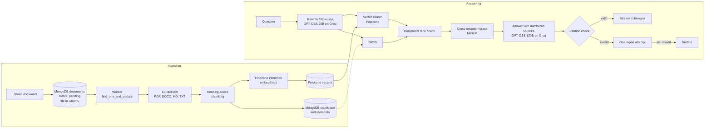

# Enterprise RAG

A production-grade retrieval-augmented generation service for an organisation's internal documents. People ask questions in plain language and get short answers in which every factual sentence cites the passage it came from. When the documents don't cover a question, the assistant says so instead of guessing.

Retrieval combines BM25 keyword search with Pinecone vector search, merges the two rankings with reciprocal rank fusion, and reranks the result with a cross-encoder. Generated answers are checked for citations before they are shown. A 49-question evaluation set runs in CI and blocks changes that make retrieval worse. MongoDB stores documents, passage text, conversations and chat history; Pinecone stores and searches passage vectors.

The repository ships with an eleven-document employee handbook for a fictional company, Kestrel Systems, which serves as both the demo knowledge base and the evaluation corpus.

## Contents

- [How it works](#how-it-works)
- [Results](#results)
- [Running it locally](#running-it-locally)
- [Testing and evaluation](#testing-and-evaluation)
- [Deployment](#deployment)
- [Configuration](#configuration)
- [Project layout](#project-layout)
- [Design decisions](#design-decisions)

## How it works



**Ingestion.** A user uploads PDF, Word, Markdown or text files. Each file is validated by its signature, deduplicated by SHA-256 through a unique index, and stored in GridFS, so the API and worker don't need a shared disk. A separate worker process claims pending documents atomically with `find_one_and_update`, which means several workers can run safely without a queue service. Text is split along the document's own headings, and long sections are cut on sentence boundaries with overlap. Each chunk is embedded together with its document title and section heading. Transient failures retry up to three times. Unreadable files fail immediately with a message the user can act on.

**Retrieval.** A question runs through two retrievers:

- **Dense:** Pinecone's `multilingual-e5-large` inference API creates 1,024-dimensional passage and query embeddings. Those vectors are stored and searched in Pinecone; matching passage text is retrieved from MongoDB by vector ID.
- **Lexical:** Okapi BM25 over the same contextual text.

The two rankings are merged with reciprocal rank fusion. The top twelve candidates are rescored by the `ms-marco-MiniLM-L-6-v2` cross-encoder, and the best five go to the model. If even the best candidate scores as clearly unrelated, the question is declined without calling the model. Every stage is timed.

**Generation and citation enforcement.** The model receives the passages as numbered sources. It is instructed to:

- cite a source at the end of every factual sentence
- reply with a fixed token when the sources don't answer the question
- treat source text as reference material, never as instructions

The draft is then checked: every `[n]` must refer to a real source, and at least 80% of claim sentences must carry a citation. A failing draft gets one repair request listing the specific problems. If the repaired version still fails, the assistant declines. The abstention token is held back from the stream, so users never see it. Follow-up questions are rewritten into standalone ones by a smaller model before searching.

**Access and chat.** There is no sign-in. The browser generates a random client ID and sends it with every request. Conversations are stored against that ID in MongoDB, so each browser sees only its own history. Questions and uploads are rate limited per network address. Reading, uploading, re-indexing, and deleting documents are open to anyone who can reach the service. Each stored answer keeps its citations, token usage, stage timings and optional thumbs up or down feedback. Answers stream over server-sent events.

## Results

Retrieval quality on the 49-question golden set, from the committed baseline in [`backend/evals/baseline.json`](backend/evals/baseline.json). Of the 49 questions, 41 are answerable: direct lookups, paraphrases, cross-document distractors and multi-section questions. The other 8 are questions the handbook cannot answer, including a prompt-injection attempt.

| Strategy | Hit rate @5 | Recall @5 | MRR | nDCG @5 |
| --- | --- | --- | --- | --- |
| Vector search only | 0.976 | 0.963 | 0.951 | 0.947 |
| BM25 only | 0.927 | 0.915 | 0.808 | 0.828 |
| Hybrid (RRF) | 0.976 | 0.963 | 0.902 | 0.912 |
| **Hybrid + rerank** | **1.000** | **0.988** | **0.981** | **0.976** |

Six of the eight unanswerable questions are rejected at retrieval, before any model call. The other two sound like real policy topics ("bereavement leave", "annual bonus"), so they are left for the model to decline, which the answer-quality suite measures.

On a laptop CPU, retrieval takes about 600 ms at the median and 880 ms at p95, most of it in the cross-encoder. [docs/evaluation.md](docs/evaluation.md) explains the methodology and how the evaluation caught a miscalibrated reranker threshold during development.

Answer-quality metrics are produced by the full suite, which needs a Groq API key: answer accuracy against expected facts, abstention accuracy, citation precision, and faithfulness graded by a separate judge model. The nightly [Answer quality](.github/workflows/evaluation.yml) workflow publishes that report.

## Running it locally

For the quickest local setup on Windows, use Docker Desktop with Compose and Node.js 20+. You don't need to install Python or MongoDB on your computer for this option. Create a Pinecone dense vector index with 1,024 dimensions and cosine similarity first, then configure its API key for the API and worker. The native backend setup below needs Python 3.11+ and a MongoDB 7+ server.

**With Docker Compose (Windows PowerShell)**

If Docker Desktop isn't installed, [install it for Windows](https://docs.docker.com/desktop/setup/install/windows-install/) and start it. Wait until Docker Desktop says the engine is running. From the repository root, add your Pinecone API key to the existing `.env` file. If you don't have a root `.env` yet, copy `.env.example` first. Keep any existing MongoDB URL in place; Compose uses its local MongoDB container when running the stack. The API uses the Pinecone key for hosted embeddings and vector operations. Add a Groq key only if you want generated chat answers.

```powershell
if (!(Test-Path .env)) { Copy-Item .env.example .env }
notepad .env
# Set PINECONE_API_KEY; GROQ_API_KEY is optional.
```

Then start MongoDB, the API and the background worker, and load the demo handbook:

```powershell
docker compose up --build -d
docker compose cp .\knowledge_base api:/srv/knowledge_base
docker compose exec api python -m app.cli ingest /srv/knowledge_base
```

The first build downloads dependencies and the local reranker model, so it can take a while. The handbook is queued for indexing by the worker; Pinecone generates its embeddings.

**Backend without Docker**

```bash
cd backend
python -m venv .venv && source .venv/bin/activate
pip install -e ".[dev]"
test -f .env || cp .env.example .env
python -m app.cli ingest ../knowledge_base --process
uvicorn app.main:create_app --factory --reload
```

In `.env`, set `MONGODB_URL`, `PINECONE_API_KEY`, `PINECONE_INDEX_NAME`, and `PINECONE_NAMESPACE`; set `GROQ_API_KEY` if you want generated answers. Run `python -m app.worker` in a second terminal to index files uploaded through the web app, or set `EMBEDDED_WORKER=true` to run the worker inside the API process.

**Frontend**

```powershell
Set-Location frontend
npm.cmd ci
npm.cmd run dev
```

Keep the frontend command running, then open http://localhost:5173. The landing page links straight to the assistant. To upload documents, open **Documents** and choose files to add. Without `GROQ_API_KEY`, retrieval and the search inspector still work, and chat reports that the model is unavailable. In Bash, use `cd frontend`, `npm ci` and `npm run dev` instead.

To stop the frontend, press **Ctrl+C** in its terminal. To stop the backend services, run `docker compose down` from the repository root. This keeps the MongoDB volume and its data.

## Testing and evaluation

```bash
cd backend
ruff check . && ruff format --check . && mypy
TEST_MONGODB_URL=mongodb://localhost:27017 pytest
python -m evals.run --suite retrieval
GROQ_API_KEY=... python -m evals.run --suite full
```

```bash
cd frontend
npm run format:check && npm run lint && npm run typecheck && npm test && npm run build
```

The integration tests run against a real MongoDB server and drop their own `enterprise_rag_test` database before each test. Their Pinecone index and embedding calls are fakes. The retrieval evaluation calls Pinecone's hosted embedding API and needs `PINECONE_API_KEY`.

The evaluation gate in [`backend/evals/thresholds.toml`](backend/evals/thresholds.toml) fails the run when any metric drops below its floor, or falls more than 0.02 below the committed baseline. The current baseline predates the move to Pinecone hosted embeddings. After setting `PINECONE_API_KEY`, refresh it with `python -m evals.run --suite retrieval --update-baseline` from `backend`, then commit the reviewed `backend/evals/baseline.json` update.

**Continuous integration** runs on every push and pull request:

| Job | What it checks |
| --- | --- |
| Backend checks | Ruff, formatting, mypy, 86 tests against a MongoDB service container |
| Retrieval quality gate | The retrieval suite against floors and the baseline |
| Frontend checks | Prettier, ESLint with zero warnings, TypeScript, Vitest, production build |
| Container image | The backend Docker image builds |

The retrieval evaluation calls Pinecone's hosted embedding API, so add `PINECONE_API_KEY` as a GitHub Actions secret. The full answer-quality evaluation also needs a `GROQ_API_KEY` secret and runs nightly, on demand and on pushes to `main`.

## Deployment

The backend runs on Render as an API and an ingestion worker built from the same Dockerfile, the frontend runs on Vercel, MongoDB Atlas stores application data, and Pinecone stores passage vectors. [`render.yaml`](render.yaml) defines both backend services. GitHub Actions runs CI and deploys the tested `main` commit to Render and Vercel only after CI succeeds.

**MongoDB Atlas**

1. Create an Atlas project and cluster in a region near the Render services. A free cluster works for a demo; choose a production tier with the capacity and backup options you need for real data.
2. Under **Database Access**, create a database user with the `readWrite` role scoped to `enterprise_rag`. The app creates its collections and regular indexes on startup.
3. Under **Connect**, choose **Drivers** and copy the `mongodb+srv://` connection string. URL-encode special characters in the username or password. Set this as `MONGODB_URL`; set the database name separately as `MONGODB_DATABASE=enterprise_rag`.
4. Atlas accepts connections only from addresses in the project's IP access list. After creating the Render services, open each service's **Connect > Outbound** page and add its listed CIDR ranges to Atlas **Network Access**. Services in the same Render region use shared outbound ranges; Render also offers dedicated outbound IPs on paid plans. For a temporary demo only, `0.0.0.0/0` allows all IPv4 addresses; use a strong unique database password and remove that entry after testing.

**Pinecone**

1. Create a standard dense vector index in Pinecone with **1,024 dimensions** and the **cosine** metric. This project uses Pinecone's hosted `multilingual-e5-large` inference API for both document and query embeddings, then upserts and queries the resulting vectors. Set the index dimension to match `PINECONE_EMBEDDING_DIMENSIONS`.
2. This project is configured for the `enterprise-rag-1024` index and `enterprise-rag` namespace. Pinecone creates the namespace when the app first writes vectors.

Pinecone applies upserts asynchronously, so a newly indexed document can take a short time to appear in search. If you already created an index with the earlier 384-dimensional FastEmbed setup, create a new 1,024-dimensional index and update `PINECONE_INDEX_NAME`; index dimensions cannot be changed. After deploying, reprocess existing documents in the Documents page so their vectors are regenerated by Pinecone.

**Render**

1. Push the repository to GitHub. Before creating the Render Blueprint, open `render.yaml` and set both `region` values to the Render region nearest your Atlas cluster. The example uses Oregon.
2. In Render, choose **New > Blueprint**, connect this repository, and create the services from `render.yaml`. It creates a public `enterprise-rag-api` web service and a private `enterprise-rag-worker` background worker. Both use the `backend/Dockerfile`; the worker starts with `python -m app.worker`.
3. When Render asks for values marked `sync: false`, provide the Atlas `MONGODB_URL`, Pinecone `PINECONE_API_KEY`, Groq `GROQ_API_KEY`, and API `CORS_ORIGINS`. Enter the same Atlas URL and Pinecone key for the API and worker. Set the initial `CORS_ORIGINS` to `http://localhost:5173`; replace it with the Vercel production origin after deploying the frontend. Do not put secrets in `render.yaml`.
4. Open each service's **Connect > Outbound** page and add the listed IP ranges to Atlas **Network Access**. Generate a public domain for `enterprise-rag-api`. Its health check is `/api/v1/health/ready` (already configured in the Blueprint); the worker does not need a public domain. Confirm both services are running and that the API logs show a successful MongoDB connection.
5. Open each service's **Settings > Deploy Hook** and create a hook. Add the API and worker hook URLs to GitHub Actions secrets as described below. The Blueprint disables automatic Render Git deploys so the tested GitHub Actions workflow controls production releases.

`render.yaml` allocates 1 CPU / 2 GB RAM to the API and 0.5 CPU / 512 MB RAM to the worker. Both are paid compute plans; check Render's current pricing before creating the services. The worker is separate so document ingestion continues independently of web requests. Add `GROQ_API_KEY` and `CORS_ORIGINS` only to the API; the worker does not need them. Other backend options have defaults listed in [`backend/.env.example`](backend/.env.example).

**Vercel**

1. Import the repository into Vercel and set the project root directory to `frontend`. The project uses Vite, `npm run build`, and the `dist` output directory; [`frontend/vercel.json`](frontend/vercel.json) handles SPA routing, asset caching, and security headers.
2. In Vercel's Production environment variables, set `VITE_API_URL` to the Render API's public origin, for example `https://enterprise-rag-api.onrender.com`. Do not add a trailing slash or `/api/v1`; the frontend adds `/api/v1` itself. Vite embeds this value at build time, so redeploy after changing it.
3. Copy the production frontend origin, such as `https://your-project.vercel.app`, into the Render API's `CORS_ORIGINS` variable. Save the variable and let Render redeploy the API.

**GitHub Actions deployment**

[`ci.yml`](.github/workflows/ci.yml) runs on pull requests and pushes to `main` or `development`. [`deploy.yml`](.github/workflows/deploy.yml) runs only after CI succeeds for a push to `main`; it triggers Render deploy hooks for the API and worker, then builds and deploys the frontend to Vercel. The Render hooks deploy the same commit that passed CI.

1. In GitHub, open **Settings > Secrets and variables > Actions > New repository secret**. Add `PINECONE_API_KEY` for the retrieval quality CI job; `RENDER_API_DEPLOY_HOOK_URL` and `RENDER_WORKER_DEPLOY_HOOK_URL` from the two Render services; and `VERCEL_TOKEN`, `VERCEL_ORG_ID`, and `VERCEL_PROJECT_ID` from your Vercel account and project. Keep these private.
2. Set Vercel's project root to `frontend` and create a Vercel access token. Find the organization/team ID and project ID in Vercel's project settings. The workflow links the frontend project with these IDs, pulls its Production variables, runs `vercel build --prod`, and deploys the prebuilt output.
3. Disable automatic Git deployments in Vercel if enabled. Render auto-deploy is already disabled in the Blueprint. Push or merge to `main`; GitHub runs CI first and deploys only after it succeeds. Pull requests run CI but do not deploy production.

The local `backend/.env` file is ignored by Git. Add the Atlas URL and Pinecone key to the Render API and worker environment variables; add the Pinecone key to GitHub Actions secrets for CI. Never commit `.env` files or paste credentials into workflow files.

**Load the demo handbook**

After the API, worker and frontend are live and CORS is configured, open **Documents** in the app and upload the files from [`knowledge_base/`](knowledge_base). The worker indexes each uploaded file. Check the document statuses before trying questions.

**Access model**

The chat, document reading, search inspector, uploads, re-indexing, and deletion are public. Put the deployment behind a VPN or single sign-on proxy before uploading confidential internal documents.

## Configuration

All backend settings are environment variables, listed with defaults in [`backend/.env.example`](backend/.env.example). The most important ones:

| Variable | Default | Purpose |
| --- | --- | --- |
| `MONGODB_URL` | `mongodb://localhost:27017` | MongoDB connection string |
| `MONGODB_DATABASE` | `enterprise_rag` | Database name |
| `PINECONE_API_KEY` | unset | Pinecone API key used for hosted embeddings and vector upserts, queries, and deletes |
| `PINECONE_INDEX_NAME` | `enterprise-rag` | Existing Pinecone dense vector index name |
| `PINECONE_NAMESPACE` | `enterprise-rag` | Pinecone namespace for this application's vectors |
| `PINECONE_EMBEDDING_MODEL` | `multilingual-e5-large` | Pinecone hosted model used for passage and query embeddings |
| `PINECONE_EMBEDDING_DIMENSIONS` | `1024` | Expected embedding width; must match the Pinecone index |
| `ENVIRONMENT` | `development` | Runtime environment; use `production` when deployed |
| `GROQ_API_KEY` | unset | Enables answer generation |
| `ANSWER_MODEL` | `openai/gpt-oss-120b` | Groq model that writes answers |
| `REWRITE_MODEL` | `openai/gpt-oss-20b` | Groq model that rewrites follow-up questions |
| `LLM_REASONING_EFFORT` | `low` | Reasoning effort for the Groq models |
| `RETRIEVAL_TOP_K` | `5` | Passages sent to the model |
| `RETRIEVAL_RERANK_CANDIDATES` | `12` | Fused candidates rescored by the cross-encoder |
| `RETRIEVAL_MIN_RELEVANCE` | `0.00005` | Below this best score a question is treated as off-topic |
| `CITATION_MIN_COVERAGE` | `0.8` | Share of claim sentences that must carry a citation |
| `CHAT_RATE_LIMIT_PER_MINUTE` | `20` | Questions per address per minute |

## Project layout

```
backend/
  app/
    api/            HTTP routes and request dependencies
    core/           settings, logging, errors, middleware, rate limiting
    db/             MongoDB client, collections, indexes and records
    ingestion/      text extraction, chunking, pipeline and worker
    retrieval/      embeddings, BM25, fusion, reranking, hybrid retriever
    generation/     Groq client, prompts, citation checks, answer service
    services/       documents, chat and corpus bookkeeping
    telemetry/      per-request stage timing
  evals/            golden dataset, metrics, judge, runner, thresholds, baseline
  tests/            unit tests and MongoDB integration tests
frontend/
  src/
    app/            routing and application shell
    components/     wordmark and UI primitives
    features/       landing page, chat, documents and search inspector
    lib/            API client, SSE reader, formatting, citation rendering
knowledge_base/     the demo handbook and evaluation corpus
```

## Design decisions

**MongoDB and Pinecone have separate jobs.** MongoDB stores original files, passage text, document records, conversations, messages and feedback. Pinecone stores and searches the passage vectors. The API resolves Pinecone's matching vector IDs back to passage text in MongoDB before reranking.

**No sign-in.** Anyone who can reach the assistant can ask questions and change the knowledge base. Browsers are kept apart by a random client ID, and rate limits apply per address, so rotating IDs doesn't bypass them. For a real deployment, place the service behind a VPN or a single sign-on proxy before adding internal documents.

**BM25 in the API process.** The index for a document collection of this size builds in milliseconds and is rebuilt only when the corpus changes. At much larger scale, the lexical side should move to a search engine or Atlas Search.

**Pinecone hosted embeddings.** Pinecone creates embeddings for both document passages and search queries, using the model's `passage` and `query` modes. This keeps embedding generation and vector search on the Pinecone service. The cross-encoder reranker runs locally in the API container; Groq serves chat models.

**The relevance threshold filters only off-topic questions.** Cross-encoder scores aren't calibrated for conversational questions, and correct passages sometimes score 0.0001. So the threshold only removes questions nothing in the corpus relates to. Whether an on-topic question is actually answered is decided by the grounded prompt and the citation check. See [docs/evaluation.md](docs/evaluation.md).

**Withholding beats hedging.** When citations fail validation twice, the user gets an explicit "not covered" answer rather than an unverified one.

**Groundwork for monitoring.** Every answer already records per-stage durations, token counts per model call, citation coverage, repair and abstention outcomes, and user feedback. Request IDs flow through logs and error responses. Tracing export, latency percentiles, cost per request and regression dashboards can build on this data without changing the pipeline.
